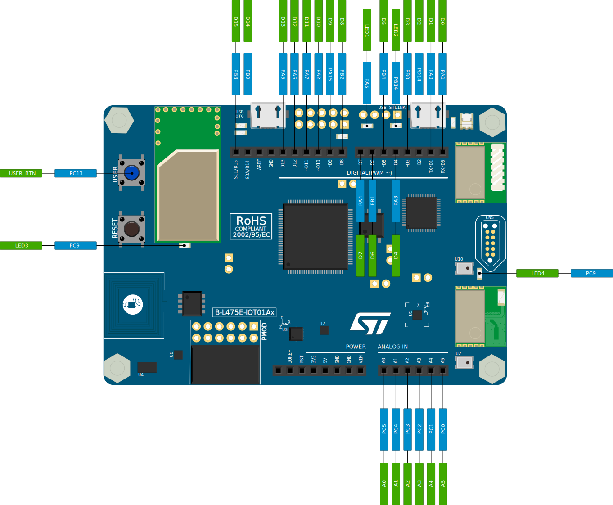

# 

## La Rochelle Software Craftsmenship

* **Auteurs:**

  * [Sébastien NEDJAR](mailto:sebastien.nedjar@univ-amu.fr)

* **Besoin d'aide ?**

  * Consulter et/ou créer des [issues](https://github.com/CraftLR/workshop-rust-blink/issues).
  * [Email](mailto:sebastien.nedjar@univ-amu.fr) pour toutes questions autres.

## Aperçu du workshop et objectifs d'apprentissage

Rust est un langage de programmation conçu pour la programmation système. Dans de tels langages, l'accès bas niveau, la performance et l'utilisation parcimonieuse du materiel sont des éléments centraux. Ces qualités font de Rust un candidat idéal pour programmer les plateformes les plus contraintes en terme de ressources (vitesse de calcul, mémoire vive, mémoire flash, ...) : les microcontrôleurs.

En plus de continuer à découvrir de nouvelles facettes de Rust, cet atelier vise à découvrir les particularité de l'embarqué *bare metal* sur des microcontrôleurs de chez STMicroelectronics. Certains aspects ne seront que survolés car l'objectif premier est d'avoir rapidement un premier exemple avec lequel jouer pour approfondir les concepts plus complexes.

## Découvrir la programmation embarquée avec Rust

Jusqu'à l'arrivée de Rust, le domaine de la programmation embarquée était le domaine quasi exclusif du C et du C++. En plus de ses performances, Rust apporte de la sûreté (à travers sa gestion de la mémoire validé à la compilation), ses concepts forts (généricité, inférence de type, filtrage par motif, ...) et son outillage intégré par défaut (un gestionnaire de chaîne d'outil `rustup`, un gestionnaire de paquets et de dépendances `cargo`, un linter `clippy`, un formateur de code intégré `fmt`, ...).

Commencer à programmer en Rust ne demande que quelques minutes. La mise en place d'un environnement de compilation croisé pour faire de l'embarqué n'est pas beaucoup plus compliqué. Comme nous allons le découvrir dans cet atelier, en moins d'une dizaine de minute, on sera capable de programmer un microcontrôleur et même de le déboguer !

Pour aller plus loin, la communauté Rust met à disposition un livre de référence pour la programmation embarqué :
<https://docs.rust-embedded.org/book/>

Ce livre est assez complet pour se lancer en comprenant l'essentiel des particularités du Rust embarqué.

La première chose à faire est de créer un fork de ce dépôt. Pour ce faire, rendez-vous sur le lien suivant :

<https://classroom.github.com/a/9kfzJ1Mm>

GitHub va vous créer un dépôt contenant un fork de ce dépôt. Vous apparaîtrez automatiquement comme contributeur de ce projet pour y pousser votre travail. Clonez localement votre fork et ouvrez le avec Visual Studio Code.

Le code de départ de ce dépôt est basé sur celui de [l'environnement de distant de développement d'application graphique en C#](https://github.com/CraftLR/RemoteDevelopmentCsharpWithAvaloniaUI). Cet environnement, permet de disposer de l'ensemble des outils nécessaires au développement d'application graphique et à la gestion de la qualité de code. Si vous n'avez pas pris le temps de le tester, il est conseillé de le faire avant de commencer cet atelier même si les éléments les plus important seront rappelés.


## Le materiel

La programmation embarquée par essence se fait sur une carte électronique avec un microcontrôleur spécifique. Dans notre cas, nous allons utiliser un microcontrôleur de la famille des STM32 de chez STMicroelectronics. Les puces STM32 sont regroupées dans [différentes séries](https://www.st.com/en/microcontrollers-microprocessors/stm32-32-bit-arm-cortex-mcus.html), basées sur les processeurs d'architecture [ARM 32-bits](https://www.st.com/content/st_com/en/arm-32-bit-microcontrollers.html), tels que le Cortex-M0, Cortex-M0+,Cortex-M3, Cortex-M4, Cortex-M7 et depuis peu des Cortex-M33. Chaque microcontrôleur est constitué d'un cœur de calcul, de mémoire vive (RAM), de mémoire flash (pour le stockage), d'une interface de débogage et de différents périphériques.

### La carte `B-L475E-IOT01A`

STMicroelectronics produit différentes cartes de développement pour permettre de découvrir les possibilités de leurs produits. Il existe deux gammes. La première appelée [Nucleo](https://www.st.com/en/evaluation-tools/stm32-nucleo-boards.html) est constituée des cartes de développement à bas prix à destination du marché des Makers. Les cartes Nucleo sont principalement centrées sur le microcontrôleur et comportent peu de composants additionnels. La seconde, la gamme Discovery, est constituée de carte au prix plus élevé qui permettent d'aller plus loin dans la découverte du materiel en intégrant des capteurs, des périphériques et des bus additionnels.

Pour cet atelier, nous allons utiliser la carte [`B-L475E-IOT01A`](https://www.st.com/en/evaluation-tools/b-l475e-iot01a.html) qui est un kit de développement pour découvrir l'IoT. Elle comporte plusieurs capteurs (accéléromètre, gyroscope, magnétomètre, humidité, pression, température, distance, microphone) et plusieurs interfaces de communication sans-fil (Bluetooth, NFC, SubGHz, Wi-Fi). Ces cartes ont été mises à disposition de l'association [LAB](https://labaixbidouille.com/) pour aider à la mise en oeuvre des projets [Let's STEAM](https://www.lets-steam.eu/?lang=fr), [TheDexterLab](http://www.thedexterlab.eu/) et [Magnetics](https://www.magnetics.edu-up.fr/).


Ces cartes peuvent être utilisées facilement dans différents langages et avec un grand nombre de plateforme d'apprentissage de la programmation ([Makecode](https://makecode.lets-steam.eu/), [µPython](https://stm32python.gitlab.io/fr/), [Arduino](https://github.com/stm32duino/Arduino_Core_STM32/wiki), [Mbed OS](https://os.mbed.com/platforms/ST-Discovery-L475E-IOT01A/), ...).

Le modèle que l'on va utiliser aujourd'hui diffère légèrement de la version commerciale car la sonde de débogage utilise [DAPLink](https://daplink.io/) en lieu et place du [STLink](https://www.st.com/en/development-tools/st-link-v2.html). Ce changement permet d'ajouter des fonctionnalités comme le WebUSB qui simplifie grandement l'usage pédagogique de la carte. Pour l'atelier, ce changement n'aura aucun impact car les outils s'adaptent silencieusement.

Si jamais vous achetez une carte `B-L475E-IOT01A` dans le commerce et que vous voulez avoir le même firmware, vous pouvez utiliser cet outil : <https://github.com/letssteam/DapLink-EasyFlash>

### Support Rust du `STM32L475VGT6`

Le kit `B-L475E-IOT01A` est construit autour du microcontrôleur `STM32L475VGT6`. La communauté Rust supporte un grand nombre de microcontrôleurs dont celui là. Si tel n'avait pas été le cas, l'ajout du support aurait pu être fait assez simplement avec l'outil [`svd2rust`](https://github.com/rust-embedded/svd2rust) qui transforme le descripteur SVD fourni par le constructeur en une bibliothèque Rust permettant d’accéder facilement à tous les registres du `STM32L475VGT6`.

Dans notre cas, il suffira simplement d'ajouter la bibliothèque [`stm32l4xx_hal`](https://docs.rs/stm32l4xx-hal/latest/stm32l4xx_hal/) à notre projet.

## Préparation de l'environnement

L'installation des outils est assez simple tant que vous êtes sous Linux ou OSX. Sous Windows, il semble que ce soit moins évident donc il faudra probablement chercher un peu plus.

Sous Linux et OSX, vous pouvez vous en sortir en ayant simplement une installation Rust fonctionnelle. Si ce n'est pas le cas, installer `rustup` peut se faire en une seule commande :

```sh
curl --proto '=https' --tlsv1.2 -sSf https://sh.rustup.rs | sh
```

Une fois `rustup` installé, assurez-vous d'avoir la version la plus récente de Rust. Si ce n'est pas le cas, vous risqueriez de devoir recompiler les outils plusieurs fois.

En plus de cela, vous devez avoir la bonne cible `thumbv7em-none-eabihf` et quelques composants cargo additionnels qui pourront être installé avec les commandes suivantes :

```sh
rustup update
rustup component add llvm-tools-preview
rustup target add thumbv7em-none-eabihf
cargo install cargo-binutils probe-rs-debugger cargo-embed cargo-flash cargo-expand cargo-generate
```

Sous Linux, il est possible que vous ayez besoin d'ajouter quelques dépendances pour que ces commandes puissent aller jusqu'au bout. Par exemple, sur une Ubuntu, vous devez installer les paquets `gdb-multiarch`, `libudev`, `libudev-dev`, `libssl-dev` et `pkg-config`.

Grâce à probe.rs (installé avec `cargo-embed`), nous avons tout ce dont nous avons besoin pour commencer utiliser notre carte et y téléverser un programme.

## Première compilation et vérification de l'installation

En clonant le présent dépôt, vous pouvez directement compiler un exemple simple. Cet exemple que l'on verra plus tard en détail fait clignoter alternativement les deux LED situées à coté de la prise l'USB de la sonde de débogage.

Pour vérifier que votre configuration est fonctionnelle, tapez les deux commandes suivantes :

```sh
cargo build 
cargo flash --chip STM32L475VGTx
```

La première compile simplement le projet et la seconde va flasher le programme dans le microcontrôleur à travers la sonde de débogage.

Une fois la carte programmée, les deux LEDs devraient clignoter alternativement avec un délais de 1s.


Si jamais l'une des commandes donne une erreur, revérifiez bien que l'étape précédente s'est correctement déroulée jusqu'au bout. Si c'est le cas, il est possible que votre utilisateur n'ait pas le droit d’accéder à la sonde de débogage. Pour lui donner les droits nécessaires, le plus simple est d'ajouter une règle `udev` en suivant ce guide : <https://docs.platformio.org/en/stable/core/installation/udev-rules.html>.

## Création du projet depuis zéro

Si vous voulez recréer un projet depuis zéro, plusieurs étapes sont nécessaires.

### Génération

Premièrement générer le projet embarqué minimal :

```sh
cargo generate --git https://github.com/rust-embedded/cortex-m-quickstart
```

```sh
🤷   Project Name: blink
🔧   Destination: /tmp/blink ...
🔧   project-name: blink ...
🔧   Generating template ...
🔧   Moving generated files into: `/tmp/blink`...
Initializing a fresh Git repository
✨   Done! New project created /tmp/blink
```

```sh
cd blink
```

### Configuration des dépendances

Modifiez le fichier `Cargo.toml` pour mettre uniquement les dépendances nécessaires :

```toml
[package]
authors = ["John Smith"]
edition = "2021"
readme = "README.md"
name = "blink"
version = "0.1.0"

[dependencies]
cortex-m = { version = "0.7", features = ["critical-section-single-core"]}
cortex-m-rt = "0.7"
stm32l4xx-hal = { version = "0.7", features = ["stm32l475", "rt"] }
rtt-target = {version="0.4"}

# this lets you use `cargo fix`!
[[bin]]
name = "blink"
test = false
bench = false

[profile.release]
codegen-units = 1 # better optimizations
debug = true # symbols are nice and they don't increase the size on Flash
lto = true # better optimizations
```

Les trois premières dépendances sont là pour permettre au programme d'accéder aux différents registres de l'ensemble des périphériques mis à disposition par le microcontrôleur. Ces [registres sont mappés en mémoire](https://docs.rust-embedded.org/book/start/registers.html) à des addresses spécifiques qui dépendent de la famille et du modèle précis de microcontrôleur. Ce mapping est décrit dans la [datasheet](https://www.st.com/resource/en/reference_manual/rm0351-stm32l47xxx-stm32l48xxx-stm32l49xxx-and-stm32l4axxx-advanced-armbased-32bit-mcus-stmicroelectronics.pdf) et aussi dans le fichier [SVD](https://github.com/jaxxzer/stm32-boilerplate/blob/master/lib/svd/stm32l4/STM32L4x5.svd) mis à disposition par le fabriquant.

Ces bibliothèques mettent à disposition plusieurs concepts spécifiques au Rust embarqué comme le *Micro-architecture crate*, le *Peripheral Access Crate (PAC)* et le *Board Crate*. Chacun de ces concepts définit une abstraction d'accès à une partie du materiel. Le premier est lié à l'architecture (ARM Cortex-M), le second aux périphériques du microcontrôleur et la dernière à la carte électronique à proprement parler. Dans notre cas, pour le premier exemple, on n'aura pas de *Board Crate*.

La dernière dépendance permet d'utiliser la communication `RTT`(pour *Real-Time Transfer*) qui permet d'échanger des données avec le microcontrôleur à travers la sonde de débogage. L'utilisation de cette bibliothèque permet de facilement connaître l'état de l'exécution du programme sans avoir besoin de configurer un port série.

### Compilation croisée

Pour activer la compilation croisée par défaut (et éviter d'appeler `cargo` avec l'option `--target thumbv7em-none-eabi`), modifier le fichier `.cargo/config.toml` et dans la section `[build]` décommenter la ligne suivante :

```toml
# target = "thumbv7em-none-eabihf" # Cortex-M4F and Cortex-M7F (with FPU)
```

En commentant celle-ci :

```toml
target = "thumbv7m-none-eabi"        # Cortex-M3
```

### Configuration de la mémoire

Ouvrir le fichier `memory.x` et adapter la configuration de la mémoire du microcontrôleur :

```text
/* Linker script for the STM32L475VG*/
MEMORY
{
/* NOTE 1 K = 1 KiBi = 1024 bytes */
FLASH : ORIGIN = 0x08000000, LENGTH = 1024K
RAM : ORIGIN = 0x20000000, LENGTH = 96K
}

/* This is where the call stack will be allocated. */
/* The stack is of the full descending type. */
/* NOTE Do NOT modify `_stack_start` unless you know what you are doing */
_stack_start = ORIGIN(RAM) + LENGTH(RAM);
```

Ce fichier permet au linker de bien placer les différents éléments du programme dans la mémoire. Il est a modifier une fois et après on peut l'oublier.

### Réglage de `cargo-embed`

Créer le fichier `Embed.toml`. Il contiendra les réglages propres à `cargo-embed`. Il permet de facilement lancer son projet sur sa cible matérielle et aussi de communiquer avec la carte à travers le canal de communication [RTT](https://www.segger.com/products/debug-probes/j-link/technology/about-real-time-transfer/) :

```toml
[default.general]
chip = "STM32L475VGTx"

[default.rtt]
enabled = true

[default.gdb]
enabled = true
```

Pour vérifier la configuration, lancer cargo-embed :

```sh
cargo embed
```

Il va directement réaliser les étapes suivantes dans l'ordre :

1. construire votre binaire
2. détecter une sonde
3. télécharger le contenu sur la cible connectée
4. réinitialisation de la cible
5. démarrer RTT côté hôte
6. démarrer le débogage gdb

### Programme principal

Le programme principal sera le suivant :

```rust
#![no_std]
#![no_main]

// début boilerplate
use stm32l4xx_hal::{prelude::*, delay::Delay};
use core::panic::PanicInfo;
use cortex_m_rt::entry;

use rtt_target::{rtt_init_print, rprintln};
// fin boilerplate


#[entry]
fn main() -> ! {
    // début boilerplate
    rtt_init_print!();

    let core = cortex_m::Peripherals::take().unwrap();
    let device = stm32l4xx_hal::stm32::Peripherals::take().unwrap();

    let mut flash = device.FLASH.constrain();
    let mut rcc = device.RCC.constrain();
    let mut pwr = device.PWR.constrain(&mut rcc.apb1r1);

    let clocks = rcc.cfgr.sysclk(64.MHz()).pclk1(48.MHz()).freeze(&mut flash.acr,  &mut pwr);
    // fin boilerplate


    let mut gpioa = device.GPIOA.split(&mut rcc.ahb2);
    let mut gpiob = device.GPIOB.split(&mut rcc.ahb2);

    let mut led1 = gpioa
        .pa5
        .into_push_pull_output(&mut gpioa.moder, &mut gpioa.otyper);
    
    let mut led2 = gpiob
        .pb14
        .into_push_pull_output(&mut gpiob.moder, &mut gpiob.otyper);

    let mut timer = Delay::new(core.SYST, clocks);

    rprintln!("Hello, world!"); 

    led1.set_low();
    led2.set_high();

    loop {
        led1.toggle();
        led2.toggle();
        rprintln!("toggle leds"); 
        timer.delay_ms(1000_u32);
    }
}

#[panic_handler]
fn panic(panic: &PanicInfo<'_>) -> ! {
    rprintln!("panic : {}", panic); 
    loop {
    }
}
```

Pour comprendre ce qu'il fait, on va ignorer pour commencer les sections **boilerplate**.

Les annotations `#![no_main]`,`#![no_std]` indiquent à Rust que nous n'avons pas de fonction principale et que nous ne voulons pas utiliser la bibliothèque standard. Ce mode est appelé `no_std` et offre des fonctionnalités limitées. Pour commencer en embarqué et économiser autant de ressources que possible, il est important de n'activer que ce dont on a besoin et dans un premier temps, la bibliothèque standard n'en fait pas partie. En plus pour pouvoir l'utiliser, cela demandera de fournir un certain nombre d'appels systèmes coûteux à implémenter. Malgré cela, le programme aura accès à un certain nombre de fonctionnalités, non liées à la plateforme et/ou au système d'exploitation, à travers [la bibliothèque `core`](https://doc.rust-lang.org/core/).

Comparaison entre le mode `no_std` et `std` :

| feature                                                         | no_std | std    |
| :---------------                                                | :----: | :----: |
| heap (mémoire dynamique)                                        | *      | ✓      |
| collections (Vec, BTreeMap, etc)                                | **     | ✓      |
| protection contre les dépassements de pile                      | ✘      | ✓      |
| exécution du code d'initialisation avant la fonction principale | ✘      | ✓      |
| `libstd` disponible                                             | ✘      | ✓      |
| `libcore` disponible                                            | ✓      | ✓      |
| écriture de firmware, kernel, d'un bootloader                   |✓       |✘       |

\* Uniquement si vous utilisez la bibliothèque `alloc` et un allocateur approprié comme `alloc-cortex-m`.
\** Uniquement si vous utilisez la bibliothèque `collections` et que vous configurez un allocateur global par défaut.
\** `HashMap` et `HashSet` ne sont pas disponibles en raison de l'absence d'un générateur de nombres aléatoires sécurisé.

L'annotation #[entry] désigne la fonction `main` comme le point d'entrée de notre programme. Il est possible de la nommer autrement, la macro se chargerait de placer la fonction à la bonne position dans la mémoire du microcontrôleur.

Après un peu de code de base, le port GPIO A et B sont activés et ils sont divisés en broches individuelles. Les broches PA5 et PB14 correspondant respectivement à la LED 1 et 2 (voir image ci-après), des variables sont crées pour interagir directement avec. Les deux LEDs sont initialisées une allumée(état haut) et l'autre éteinte (état bas).



Un délai basé sur l'horloge du système est ensuite créé. Son utilisation est horriblement inefficace car le microcontrôleur passe son temps à attendre mais elle est simple pour commencer.

La macro `rprintln!` est un remplacement direct de `println!` qui utilise RTT. Elle permet d'afficher sur le shell de l'hôte.

Dans la boucle, se contente de changer alternativement l'état de chaque LED et attend 1s à chaque fois.

La fonction `panic` est annotée avec l'annotation `#[panic_handler]` pour indiquer au compilateur que c'est la fonction qui sera appelée si une erreur logicielle on matérielle se produit. Il existe des bibliothèques comme `panic-halt` ou `panic-rtt-target` qui implémentent cette fonction à notre place mais dans un premier temps, il est intéressant de connaître son existence.

Le code **boilerplate**, si on regarde maintenant plus en détail, s'occupe d'importer toutes les bibliothèques utilisées et aussi d'initialiser le materiel comme il se doit. D'une manière générale, les configurations des différents bus ne s'inventent pas et sont à aller chercher directement dans [la datasheet du microcontrôleur](https://www.st.com/resource/en/reference_manual/rm0351-stm32l47xxx-stm32l48xxx-stm32l49xxx-and-stm32l4axxx-advanced-armbased-32bit-mcus-stmicroelectronics.pdf). Toute erreur à ce niveau mettrait le microcontrôleur en erreur et la fonction `panic` serait appelée. La configuration passe par l'importation et l'utilisation du *Micro-architecture crate* (`cortex_m::Peripherals`) et du *Peripheral Access Crate* (`stm32l4xx_hal::stm32::Peripherals`).

### Configuration VSCode

L'intégration VSCode du projet est très simple. Pour prendre en charge Rust, il suffit d'avoir installer l'extention `rust-analyser`. Le support de probe.rs dans l'IDE se fait directement avec l'extension `probe-rs-debugger`. La configuration passe par le fichier `.vscode/launch.json` dont le contenu est le suivant :

```json
{
    "version": "0.2.0",
    "configurations": [
      {
        "preLaunchTask": "${defaultBuildTask}",
        "type": "probe-rs-debug",
        "request": "launch",
        "name": "Blink Execute",
        "chip": "STM32L475VGTx",
        "cwd": "${workspaceFolder}",
        "flashingConfig": {
            "flashingEnabled": true,
            "resetAfterFlashing": true,
            "haltAfterReset": false
          },
        "coreConfigs": [
          {
            "coreIndex": 0,
            "rttEnabled": true,
            "svdFile": "${workspaceFolder}/.vscode/STM32L4x5.svd",
            "programBinary": "${workspaceFolder}/target/thumbv7em-none-eabihf/debug/blink",
          }
        ],
        "consoleLogLevel": "Console"
      }
    ]
  }
```

Pour voir l'état de la mémoire, de la pile et de tous les registres, il suffit d'installer l’extension `Cortex-Debug`.

Le fichier `.vscode/extensions.json` contient déjà la configuration des extensions ce qui permet de simplement les installer en ouvrant le projet.

Une fois l'installation complète, vous devriez pouvoir tester et déboguer très facilement :


